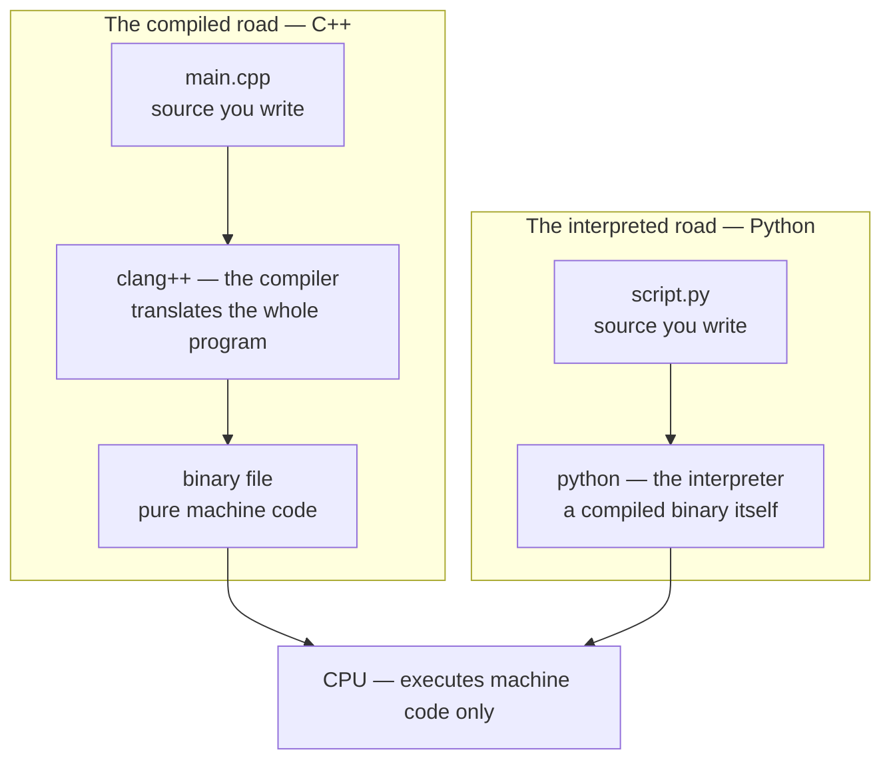
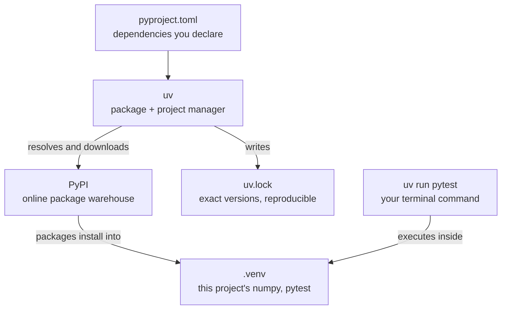

# The ecosystem, from the roots up

*What Python actually is, what uv actually does, and how source code, compilers,
interpreters, packages, and the CPU fit into one picture.*

You can use this repo by just typing the commands in the READMEs. This page is for the
deeper question: **why do those commands exist at all?** Every layer of the stack below
exists because the layer under it has a limitation. If you understand the limitation,
the tool above it stops being magic. That mode of understanding — "what problem is this
layer actually solving?" — is the same lens you'll use to design real systems.

## The bottom: the CPU speaks one language

The CPU executes **machine code** — raw numeric instructions — and nothing else. It has
never heard of Python or C++. So every language must answer one question: *how does my
source text become machine code?* There are two mainstream answers.



## Road one: compile ahead of time (C++)

The **compiler** reads your whole program *before anything runs* and translates it into
a binary file of machine code. At runtime your source code isn't even present — the CPU
chews the binary directly. Cost: a compile step and stricter rules. Payoff: maximum
speed, and whole categories of errors caught before the program ever starts.
(This is the model the [C++ track](../cpp/LEARNING_POINTS.md) builds on.)

## Road two: interpret at runtime (Python)

Python takes the other road. There is no compile step for *you* — instead, a program
called the **interpreter** (the actual `python` you run) reads your `.py` file *while
running* and does what each line says.

The insight that makes the whole picture click: **the interpreter is itself a compiled
binary** — a large program, written in C, compiled long ago on road one. When you "run
Python," the CPU is really running that C program, and *it* is reading your text. Your
code never becomes machine code; it gets *performed* — like a musician sight-reading
sheet music, where the C++ binary is a finished recording.

That is also why Python is slower (every line pays the middleman) and why the design
still wins for its purpose: no compile step means instant iteration, and the language
stays simple and flexible because nothing must be decided ahead of time.

## The bridge between the roads

`numpy`'s core is **compiled C wearing a thin Python skin**. When you write `a @ b`,
Python does one cheap interpreted step and then jumps into machine code for the million
multiplications. This is the entire reason the NumPy drill set keeps saying "no loops —
vectorize": you are choosing which road the heavy work runs on.

Zoom out and this is what an inference stack *is*: **Python orchestrates, compiled code
computes.** PyTorch, TensorRT, vLLM — Python on the outside, C++/CUDA kernels on the
inside. Learning C++ is learning to work on the inside of this same diagram.

## The package layer: reusing other people's code

- A **package** is somebody else's code, bundled so it can be installed and imported —
  `numpy`, `pytest`. Some packages (like numpy) ship compiled parts too.
- **PyPI** (the Python Package Index) is the public warehouse packages are published to
  and downloaded from.
- A **virtual environment** (the `.venv` folder) is a project-private set of installed
  packages plus a link to the interpreter. Why per-project? Version conflict: project A
  needs numpy 1.x, project B needs 2.x. One shared system-wide install cannot satisfy
  both; one folder per project makes the conflict impossible.

## The manager: what uv actually is

A **package manager** installs and removes packages, resolving version constraints. A
**project manager** goes further: it owns the whole workflow around your project.
`uv` is both in one fast tool:



1. It reads **`pyproject.toml`** — your *intent*: "this project needs numpy and pytest."
2. It talks to **PyPI** — resolves which versions satisfy that intent, downloads them.
3. It writes **`uv.lock`** — the *record*: exactly which versions were installed, down
   to checksums. Intent vs record is why two files exist: humans declare loosely,
   machines record precisely. Anyone who clones this repo and runs `uv sync` rebuilds a
   byte-identical environment. That property is called **reproducibility**, and it is
   what makes "works on my machine" a solved problem.
4. It installs into **`.venv`**, and `uv run pytest` means "run pytest *using this
   project's environment*," not whatever happens to be installed on the system. (This is
   also why a bare `pytest` can fail with `ModuleNotFoundError` while `uv run pytest`
   works — the bare command ran outside the environment.)

The two commands worth muscle memory:

```bash
uv sync          # once after cloning, and whenever dependencies change
uv run pytest    # everything else — always through uv run
```

## Why it is built this way

Read the stack bottom-up and no layer is arbitrary:

| Limitation | The layer that patches it |
|---|---|
| The CPU can't read text | compilers and interpreters |
| Code is worth reusing | packages, and PyPI to share them |
| Projects disagree about versions | one virtual environment per project |
| Environments are tedious by hand | a project manager: uv |

Ask "what limitation below made this layer necessary?" of any system — an inference
server, a robot stack, a build pipeline — and you are doing the deep version of reading
a README.
